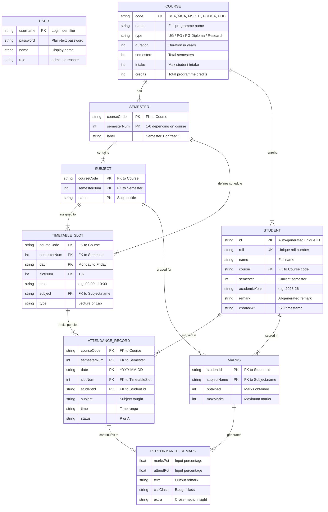

# AI-Assisted Smart Attendance & Performance Tracker

## AttendTrack v2.0 — Course-Centric Academic Management System

---

| Field                | Detail                                                         |
|----------------------|----------------------------------------------------------------|
| **Project Title**    | AI-Assisted Smart Attendance & Performance Tracker (AttendTrack) |
| **Version**          | v2.0                                                           |
| **Team**             | PGGAMER9911                                                    |
| **Event**            | GVP AI Hackathon 2026                                          |
| **Institution**      | Gujarat Vidyapith                                              |
| **Technology Stack** | HTML5, CSS3, Vanilla JavaScript, JSON                          |
| **Repository**       | https://github.com/PGGAMER9911/GVP_AI_Hackathon_2026           |
| **Date**             | February 2026                                                  |

---

## Table of Contents

1. [Abstract](#1-abstract)
2. [Introduction](#2-introduction)
3. [Problem Statement](#3-problem-statement)
4. [Objectives](#4-objectives)
5. [Scope of the Project](#5-scope-of-the-project)
6. [System Architecture](#6-system-architecture)
7. [ER Diagram](#7-er-diagram)
   - 7.1 Entity Definitions
   - 7.2 Text-Based ER Diagram
   - 7.3 Mermaid ER Diagram
8. [Database / Data Design Explanation](#8-database--data-design-explanation)
9. [Module Description](#9-module-description)
10. [AI-Assisted Features Explanation](#10-ai-assisted-features-explanation)
11. [Technologies Used](#11-technologies-used)
12. [Limitations](#12-limitations)
13. [Future Enhancements](#13-future-enhancements)
14. [Conclusion](#14-conclusion)
15. [Validation & Improvements](#15-validation--improvements)

---

## 1. Abstract

**AttendTrack** is a frontend-only, course-centric academic management system designed for multi-programme institutions. It manages five academic programmes — BCA, MCA, M.Sc. IT, PGDCA, and Ph.D. — with integrated timetable-linked attendance tracking, multi-subject marks entry, and AI-assisted performance analysis.

The system operates entirely in the browser using **HTML5, CSS3, and Vanilla JavaScript** with **localStorage** for persistent data and **sessionStorage** for authentication state. No backend server, database engine, or external API is required.

The "AI-Assisted" component is a **rule-based inference engine** that generates academic remarks using IF-ELSE threshold logic on marks percentages and cross-references those with attendance percentages to produce smart insights (e.g., "Good marks but attendance shortage — irregular student"). This approach is transparently disclosed throughout the application.

The system supports **9 seed students** across 5 courses, auto-generates **demo attendance and marks data** on first load, and provides an immediately usable experience suitable for hackathon evaluation.

---

## 2. Introduction

Educational institutions face a recurring challenge in tracking student attendance and academic performance efficiently. Traditional methods — paper registers, manual Excel entries — are error-prone, time-consuming, and lack the analytical capabilities needed for proactive academic intervention.

**AttendTrack** addresses this by providing a fully integrated, browser-based academic management system built around a **course-centric architecture**. Unlike flat student-list systems, AttendTrack models the real academic hierarchy:

```
Institution → Courses → Semesters → Subjects (from Curriculum) → Timetable Slots → Attendance Records
```

Every attendance record is tied to a specific **lecture slot** from the timetable, ensuring data integrity and enabling subject-wise attendance analysis. The system auto-calculates shortage warnings based on the **80% minimum attendance rule** and suggests the exact number of additional classes needed for recovery.

The project is built entirely with frontend technologies, making it deployable on any static hosting platform (GitHub Pages, Netlify, etc.) with zero infrastructure cost.

---

## 3. Problem Statement

Academic institutions offering multiple programmes (UG, PG, Diploma, Research) need a unified system to:

1. **Track attendance per lecture slot** (not just daily), linked to the official timetable.
2. **Calculate subject-wise attendance percentages** and flag students below 80%.
3. **Record multi-subject marks** per student per semester.
4. **Generate performance insights** by cross-referencing attendance with marks.
5. **Operate without a backend** — no server setup, no database installation, no internet dependency.

Existing solutions either require complex backend infrastructure or treat attendance as a simple daily yes/no, losing the granularity of per-lecture tracking.

---

## 4. Objectives

| # | Objective                                                                                        |
|---|--------------------------------------------------------------------------------------------------|
| 1 | Design a **course-centric data model** supporting BCA (6 sem), MCA (4 sem), M.Sc. IT (4 sem), PGDCA (2 sem), Ph.D. (year-based) |
| 2 | Implement **timetable-integrated attendance** where each record maps to a specific time slot, day, subject, and date |
| 3 | Enforce the **80% minimum attendance rule** with auto-calculated recovery suggestions              |
| 4 | Support **multi-subject marks entry** with per-subject and semester-average calculations           |
| 5 | Build a **rule-based AI remark engine** that generates academic insights from marks and attendance |
| 6 | Ensure **zero-dependency deployment** — purely HTML/CSS/JS, no build tools, no frameworks         |
| 7 | Provide **demo data injection** so evaluators see meaningful output on first load                  |

---

## 5. Scope of the Project

### In Scope

- **5 Academic Programmes**: BCA, MCA, M.Sc. IT, PGDCA, Ph.D.
- **6 Pages**: Login, Dashboard, Students, Attendance, Marks, Timetable
- **Timetable-linked attendance**: Per-slot, per-subject, per-date
- **Multi-subject marks**: Subject-wise entry linked to curriculum
- **AI remarks**: Rule-based threshold analysis + cross-metric smart insights
- **Role-based login**: Admin and Teacher roles (hardcoded credentials)
- **Data persistence**: localStorage (survives page reload/browser close)
- **Demo data**: Auto-injected on first load (5 days attendance + marks for BCA/MCA Sem 1)

### Out of Scope

- Backend server / REST API
- Real database (MySQL, MongoDB, etc.)
- Real AI/ML model or external AI API calls
- Multi-user concurrent access
- Data export (PDF, Excel)
- Mobile native app

---

## 6. System Architecture

### 6.1 Architecture Overview (Text-Based)

```
┌─────────────────────────────────────────────────────────────┐
│                      BROWSER (Client-Only)                   │
├──────────────┬───────────────────────┬──────────────────────┤
│              │                       │                      │
│  HTML Pages  │    CSS Stylesheet     │    JavaScript Hub    │
│  (6 pages)   │    (style.css)        │    (main.js)         │
│              │                       │                      │
│  login.html  │  Royal Blue Theme     │  COURSES (5 defs)   │
│  dashboard   │  (#1e40af + #0f172a)  │  CURRICULUM (subjs) │
│  students    │  Responsive Layout    │  TIME_SLOTS (5)     │
│  attendance  │  Cards, Tables,       │  DAYS (Mon-Fri)     │
│  marks       │  Forms, Badges        │  Store (CRUD+Att)   │
│  timetable   │  Sidebar Navigation   │  Auth (Login/Guard) │
│              │                       │  Performance (AI)   │
│              │                       │  Utils (Helpers)    │
├──────────────┴───────────────────────┴──────────────────────┤
│                                                              │
│                     STORAGE LAYER                            │
│  ┌────────────────────────┐  ┌────────────────────────────┐ │
│  │    localStorage        │  │    sessionStorage           │ │
│  │  ┌──────────────────┐  │  │  ┌────────────────────────┐│ │
│  │  │ att_students     │  │  │  │ att_session            ││ │
│  │  │ (JSON array)     │  │  │  │ {username, name, role} ││ │
│  │  ├──────────────────┤  │  │  └────────────────────────┘│ │
│  │  │ att_attendance   │  │  └────────────────────────────┘ │
│  │  │ (nested JSON)    │  │                                  │
│  │  ├──────────────────┤  │                                  │
│  │  │ att_demo_done    │  │                                  │
│  │  ├──────────────────┤  │                                  │
│  │  │ att_version      │  │                                  │
│  │  └──────────────────┘  │                                  │
│  └────────────────────────┘                                  │
├──────────────────────────────────────────────────────────────┤
│                     SEED DATA                                │
│  ┌────────────────────────┐                                  │
│  │  data/data.json        │  ← Loaded via fetch() on first  │
│  │  (9 students)          │     visit, then stored in        │
│  │                        │     localStorage permanently     │
│  └────────────────────────┘                                  │
└──────────────────────────────────────────────────────────────┘
```

### 6.2 Data Flow Diagram

```
User Login → sessionStorage (att_session)
           ↓
     Auth.guard() on every page → redirect if no session
           ↓
   Store.init() → Version Check (att_version ≠ v2.0 → clear all)
           ↓
   fetch('data/data.json') → Parse students → Save to localStorage
           ↓
   Store.injectDemoData() → Generate attendance + marks for BCA/MCA Sem 1
           ↓
   Page-specific rendering functions → Read from Store → Build UI
           ↓
   User interactions → Store.addStudent() / Store.markSlotAttendance() / Store.updateMarks()
           ↓
   Performance.getSmartRemark() → Generate AI-based insights → Display as badges/text
```

---

## 7. ER Diagram

### 7.1 Entity Definitions

Based on **actual code analysis** of `main.js`, `data.json`, and all HTML pages, the following entities and their attributes are identified:

---

#### Entity 1: **User** (Authentication)
| Attribute  | Type    | Key     | Description                 |
|------------|---------|---------|------------------------------|
| username   | String  | **PK**  | Unique login identifier      |
| password   | String  |         | Plain-text password          |
| name       | String  |         | Display name                 |
| role       | String  |         | 'admin' or 'teacher'         |

*Source: `Auth.USERS` array in `main.js` (lines 610–613). Hardcoded, not persisted.*

---

#### Entity 2: **Course**
| Attribute  | Type    | Key     | Description                                   |
|------------|---------|---------|-----------------------------------------------|
| code       | String  | **PK**  | Course code (BCA, MCA, MSC_IT, PGDCA, PHD)   |
| name       | String  |         | Full programme name                           |
| type       | String  |         | UG / PG / PG Diploma / Research               |
| duration   | Integer |         | Duration in years (0 for Ph.D.)               |
| semesters  | Integer |         | Total number of semesters                     |
| intake     | Integer |         | Maximum student intake                        |
| credits    | Integer |         | Total programme credits                       |

*Source: `COURSES` object in `main.js` (lines 35–41). Static definition, not stored in localStorage.*

---

#### Entity 3: **Semester** *(Added for design completeness)*
| Attribute    | Type    | Key     | Description                               |
|--------------|---------|---------|-------------------------------------------|
| courseCode   | String  | **PK** (composite) | References Course.code        |
| semesterNum  | Integer | **PK** (composite) | 1-6 for BCA, 1-4 for MCA, etc. |
| label        | String  |         | "Semester 1" or "Year 1"                  |

*Note: In the code, semesters are implicitly derived from `COURSES[code].semesters` via `getSemesterOptions()`. This entity is added for relational completeness — it represents the Course×Semester mapping that the code uses extensively as composite keys (e.g., `BCA_1`).*

---

#### Entity 4: **Subject**
| Attribute    | Type    | Key     | Description                                |
|--------------|---------|---------|---------------------------------------------|
| name         | String  | **PK** (composite) | Subject title                  |
| courseCode   | String  | **PK** (composite) | Parent course                  |
| semesterNum  | Integer | **PK** (composite) | Parent semester                |

*Source: `CURRICULUM` object in `main.js` (lines 48–81). Each course-semester has an array of subject name strings. Subjects serve as keys for marks and attendance tracking.*

---

#### Entity 5: **Student**
| Attribute     | Type    | Key     | Description                                 |
|---------------|---------|---------|----------------------------------------------|
| id            | String  | **PK**  | Auto-generated unique ID (e.g., STU001)     |
| roll          | String  | **UK**  | Unique roll number (e.g., BCA101)           |
| name          | String  |         | Full name                                    |
| course        | String  | **FK**  | References Course.code                      |
| semester      | Integer |         | Current semester number                     |
| academicYear  | String  |         | e.g., "2025-26"                             |
| marks         | Object  |         | Nested: { subjectName: {obtained, maxMarks} } |
| remark        | String  |         | AI-generated remark text                    |
| createdAt     | String  |         | ISO timestamp                               |

*Source: `data/data.json` seed data + `Store.addStudent()` in `main.js` (lines 320–340). Students are stored as a JSON array in `localStorage['att_students']`.*

---

#### Entity 6: **Timetable Slot**
| Attribute    | Type    | Key     | Description                                 |
|--------------|---------|---------|----------------------------------------------|
| courseCode   | String  | **PK** (composite) | Parent course                  |
| semesterNum  | Integer | **PK** (composite) | Parent semester                |
| day          | String  | **PK** (composite) | Monday–Friday                  |
| slotNum      | Integer | **PK** (composite) | 1–5                           |
| time         | String  |         | e.g., "09:00 - 10:00"                      |
| subject      | String  | **FK**  | References Subject.name                     |
| type         | String  |         | "Lecture" or "Lab"                          |

*Source: `generateTimetable()` function uses `TIME_SLOTS` (5 slots) × `DAYS` (5 days) and distributes subjects via round-robin. Generated dynamically, not stored.*

---

#### Entity 7: **Attendance Record**
| Attribute    | Type    | Key     | Description                                  |
|--------------|---------|---------|-----------------------------------------------|
| courseCode   | String  | **PK** (composite) | Course identifier              |
| semesterNum  | Integer | **PK** (composite) | Semester number                |
| date         | String  | **PK** (composite) | Date (YYYY-MM-DD)              |
| slotNum      | Integer | **PK** (composite) | Time slot number (1–5)         |
| subject      | String  |         | Subject taught in this slot                  |
| time         | String  |         | Time range                                   |
| studentId    | String  | **PK** (composite) | Student being marked           |
| status       | String  |         | "P" (Present) or "A" (Absent)               |

*Source: `Store.markSlotAttendance()` and the attendance structure in `main.js` (lines 394–425). Stored in `localStorage['att_attendance']` as nested JSON: `{course_sem → date → slot → {subject, time, records: {studentId: "P"/"A"}}}`.*

---

#### Entity 8: **Marks**
| Attribute     | Type    | Key     | Description                               |
|---------------|---------|---------|-------------------------------------------|
| studentId     | String  | **PK** (composite) | References Student.id       |
| subjectName   | String  | **PK** (composite) | References Subject.name     |
| obtained      | Integer |         | Marks obtained                            |
| maxMarks      | Integer |         | Maximum possible marks                    |

*Source: `Store.updateMarks()` in `main.js` (lines 485–523). Marks are stored as a nested object inside each student's `marks` property: `student.marks[subject] = { obtained, maxMarks }`.*

---

#### Entity 9: **Performance Remark** *(Added for design completeness)*
| Attribute    | Type    | Key     | Description                                  |
|--------------|---------|---------|-----------------------------------------------|
| marksPct     | Float   |         | Input: percentage from marks                  |
| attendPct    | Float   |         | Input: attendance percentage                  |
| text         | String  |         | Output remark text                            |
| class        | String  |         | Output CSS badge class                        |
| extra        | String  |         | Optional cross-metric insight                 |

*Source: `Performance.getRemark()` and `Performance.getSmartRemark()` in `main.js` (lines 640–665). Not stored — computed on-the-fly by the rule-based engine.*

---

### 7.2 Text-Based ER Diagram (ASCII)

```
┌─────────────────┐          ┌─────────────────────┐
│     USER         │          │       COURSE         │
│─────────────────│          │─────────────────────│
│ PK: username     │          │ PK: code             │
│    password      │          │    name               │
│    name          │          │    type               │
│    role          │          │    duration           │
└─────────────────┘          │    semesters          │
                              │    intake             │
                              │    credits            │
                              └──────────┬────────────┘
                                         │
                                    1 ── ┤── M
                                         │
                              ┌──────────┴────────────┐
                              │      SEMESTER          │
                              │ (Design Completeness)  │
                              │───────────────────────│
                              │ PK: courseCode + semNum │
                              │    label               │
                              └──────────┬────────────┘
                                         │
                           ┌─────────────┼─────────────┐
                      1 ── ┤             │        1 ── ┤
                           │             │             │
                ┌──────────┴──────┐  ┌───┴──────┐  ┌──┴───────────────┐
                │    SUBJECT       │  │ STUDENT  │  │ TIMETABLE SLOT   │
                │─────────────────│  │─────────│  │─────────────────│
                │ PK: courseCode + │  │ PK: id   │  │ PK: course+sem+  │
                │     semNum +     │  │ UK: roll │  │     day+slotNum  │
                │     name         │  │    name  │  │    time           │
                └────────┬────────┘  │  course──┤  │    subject (FK)   │
                         │           │  semester│  │    type            │
                    M ── ┤           │  acYear  │  └──────────┬────────┘
                         │           │  marks   │             │
                ┌────────┴────────┐  │  remark  │        1 ── ┤── M
                │     MARKS        │  │ createdAt│             │
                │─────────────────│  └────┬────┘  ┌──────────┴─────────┐
                │ PK: studentId +  │       │       │ ATTENDANCE RECORD  │
                │     subjectName  │  1 ── ┤── M   │───────────────────│
                │    obtained      │       │       │ PK: course+sem+    │
                │    maxMarks      │       │       │     date+slot+     │
                └──────────────────┘       │       │     studentId      │
                                           └───────┤    subject          │
                                                   │    time             │
                                                   │    status (P/A)     │
                                                   └────────────────────┘

  ┌────────────────────────────┐
  │  PERFORMANCE REMARK        │
  │  (Computed Entity)         │
  │───────────────────────────│
  │    marksPct (input)        │
  │    attendPct (input)       │
  │    text (output)           │
  │    class (output)          │
  │    extra (output)          │
  │  [Generated on-the-fly]    │
  └────────────────────────────┘
```

### 7.3 Mermaid ER Diagram



### 7.4 Relationship Summary

| Relationship                          | Type   | Description                                              |
|---------------------------------------|--------|----------------------------------------------------------|
| Course → Semester                     | 1 : M  | BCA has 6 semesters, MCA has 4, etc.                     |
| Course → Student                      | 1 : M  | Each student belongs to exactly one course               |
| Semester → Subject                    | 1 : M  | Each course-semester has 2–4 subjects                    |
| Semester → Timetable Slot             | 1 : M  | Each course-semester has 25 weekly slots (5 days × 5)    |
| Subject → Timetable Slot             | 1 : M  | Each subject appears in multiple slots (round-robin)     |
| Timetable Slot → Attendance Record   | 1 : M  | One slot per date can have many student records          |
| Student → Attendance Record           | 1 : M  | A student has attendance records across many slot-dates   |
| Student → Marks                       | 1 : M  | A student has marks in multiple subjects                 |
| Subject → Marks                       | 1 : M  | A subject can be graded for many students                |
| Marks + Attendance → Performance     | M : 1  | Computed entity — remark from combined inputs            |

---

## 8. Database / Data Design Explanation

### 8.1 Why Each Entity Exists

| Entity              | Why It Exists                                                                                              |
|---------------------|------------------------------------------------------------------------------------------------------------|
| **User**            | Provides role-based access control. Guards all pages via `Auth.guard()`.                                   |
| **Course**          | Central organising unit. All students, subjects, timetables, and attendance revolve around courses.        |
| **Semester**        | Subdivides courses into time periods. Determines which subjects are taught and which timetable applies.    |
| **Subject**         | The academic unit being taught. Drives timetable generation, attendance grouping, and marks entry.         |
| **Student**         | The primary transactional entity. Holds enrollment info, marks, and links to attendance.                   |
| **Timetable Slot**  | Defines when and what is taught. Attendance is marked per slot, not per day.                               |
| **Attendance**      | Per-slot, per-student presence record. Enables subject-wise percentage calculation.                        |
| **Marks**           | Per-subject academic scores. Combined with attendance for AI remark generation.                            |
| **Performance**     | Computed entity. Provides actionable insights by cross-referencing marks and attendance.                   |

### 8.2 How Data Flows Between Entities

```
COURSE → defines → CURRICULUM (subjects per semester)
                        ↓
           generateTimetable() → TIMETABLE SLOTS (25 per week per course-semester)
                        ↓
           User selects Course → Semester → Date → loadDaySchedule()
                        ↓
           TIMETABLE SLOTS → User clicks slot → selectSlot()
                        ↓
           STUDENTS (filtered by course+semester) → P/A toggle → saveSlotAttendance()
                        ↓
           ATTENDANCE RECORD stored: att_attendance[course_sem][date][slot] = {subject, time, records}
                        ↓
           getStudentAttendance() → aggregates across all dates/slots → subject-wise %
                        ↓
           Performance.getSmartRemark(marks%, attendance%) → AI REMARK
```

### 8.3 How JSON/JS Objects Simulate Database Behavior

| Database Concept    | JavaScript/JSON Equivalent in AttendTrack                                      |
|---------------------|--------------------------------------------------------------------------------|
| **Table**           | JavaScript Array or Object stored as JSON string in `localStorage`             |
| **Primary Key**     | `student.id` (auto-generated via `Store.generateId()`)                         |
| **Unique Key**      | `student.roll` — duplicate check in `Store.addStudent()`                       |
| **Foreign Key**     | `student.course` references `COURSES` object keys                              |
| **Composite Key**   | Attendance uses `course_semester` + `date` + `slotNum` as nested JSON keys     |
| **JOIN**            | Manual `.find()` / `.filter()` operations in JavaScript                        |
| **INSERT**          | `students.push(newStudent)` → `localStorage.setItem()`                         |
| **UPDATE**          | Find by index → modify → `localStorage.setItem()`                             |
| **DELETE**          | `.filter()` to exclude → `localStorage.setItem()` + cascade attendance         |
| **CASCADE DELETE**  | `Store.deleteStudent()` also removes student from all attendance records        |
| **Schema Version**  | `APP_VERSION = 'v2.0'` — clears all data if version changes                   |
| **Seed Data**       | `data/data.json` loaded via `fetch()` on first visit                           |
| **Index**           | No explicit index; sequential scan via `.find()` / `.filter()`                 |

### 8.4 How Timetable-Based Attendance Is Modeled

The attendance model is **slot-centric**, not day-centric:

```javascript
// Attendance structure in localStorage
{
  "BCA_1": {                        // Course_Semester composite key
    "2026-02-03": {                  // Date (YYYY-MM-DD)
      "1": {                         // Slot number (1-5)
        "subject": "Programming in C",
        "time": "09:00 - 10:00",
        "records": {
          "STU001": "P",             // Present
          "STU002": "A"              // Absent
        }
      },
      "2": {
        "subject": "Mathematics-I",
        "time": "10:00 - 11:00",
        "records": { "STU001": "P", "STU002": "P" }
      }
    }
  }
}
```

**Flow:**
1. User selects **Course → Semester → Date**
2. System calls `generateTimetable(course, semester)` to get the day's lecture schedule
3. User clicks a **specific slot** (e.g., Slot 1: Programming in C)
4. System loads students enrolled in that course+semester
5. User marks each student as **P** (Present) or **A** (Absent)
6. Record saved to `localStorage` under the composite key

**Subject-wise aggregation** (`getStudentAttendance()`):
- Iterates through all dates and all slots for the student's course+semester
- Groups by subject name → calculates `attended / total × 100`
- Returns overall percentage + per-subject breakdown

---

## 9. Module Description

### 9.1 Login Module

| Aspect        | Detail                                                                     |
|---------------|-----------------------------------------------------------------------------|
| **File**      | `login.html`                                                               |
| **Purpose**   | Authenticate users before granting access to the system                    |
| **Credentials**| `admin / admin123` (role: admin) and `teacher / pass123` (role: teacher)  |
| **Storage**   | Session stored in `sessionStorage['att_session']` as JSON                  |
| **Guard**     | `Auth.guard()` called on every protected page — redirects to login if no session |
| **Auto-redirect** | If already logged in, `login.html` redirects to `dashboard.html`       |
| **XSS Protection** | Inputs sanitized via `Utils.sanitize()` (creates text node to escape HTML) |

**Key Functions:** `Auth.login()`, `Auth.logout()`, `Auth.getSession()`, `Auth.guard()`

---

### 9.2 Student Management Module

| Aspect        | Detail                                                                     |
|---------------|-----------------------------------------------------------------------------|
| **File**      | `students.html`                                                            |
| **Purpose**   | Add, search, filter, view, and delete students across all courses          |
| **Add Form**  | Name, Roll (unique), Course (dropdown), Semester (dynamic), Academic Year  |
| **Validation**| Empty checks, duplicate roll detection, course existence check             |
| **Filter**    | By course dropdown                                                         |
| **Search**    | Real-time text search on name and roll number                              |
| **Delete**    | With confirmation dialog + cascade deletion from attendance records        |
| **AI Remark** | Displayed per student based on semester average marks                      |

**Key Functions:** `Store.addStudent()`, `Store.deleteStudent()`, `Store.getStudents()`, `Store.getStudentsByCourse()`

---

### 9.3 Course & Semester Module

| Aspect        | Detail                                                                     |
|---------------|-----------------------------------------------------------------------------|
| **File**      | Defined in `main.js` (COURSES, CURRICULUM objects) — used across all pages |
| **Courses**   | BCA (6 sem), MCA (4 sem), M.Sc. IT (4 sem), PGDCA (2 sem), Ph.D. (3 years) |
| **Curriculum**| 2–4 subjects per course-semester, totaling ~24 unique subject entries       |
| **Semesters** | Dynamically generated via `getSemesterOptions()` — auto-adapts to course   |
| **Ph.D. Special** | Uses "Year 1/2/3" labels instead of "Semester"                        |

**Key Functions:** `getSemesterOptions()`, `getSubjects()`

---

### 9.4 Timetable Module

| Aspect           | Detail                                                                  |
|------------------|--------------------------------------------------------------------------|
| **File**         | `timetable.html`                                                        |
| **Purpose**      | Display weekly lecture schedule for any course-semester combination      |
| **Time Slots**   | 5 per day: 9-10, 10-11, 11:15-12:15, 12:15-1:15, 2-3                  |
| **Days**         | Monday to Friday (weekends excluded)                                    |
| **Generation**   | `generateTimetable()` uses round-robin distribution of subjects         |
| **Slot 5 Rule**  | Always tagged as "Lab" type; others are "Lecture"                       |
| **Display**      | Grid table (rows = time slots, columns = days)                          |
| **Subject List** | Shows each subject with weekly lecture frequency count                  |
| **Course Info**   | Displays full course details (type, duration, intake, credits)         |

**Key Functions:** `generateTimetable()`, `renderTimetable()`

---

### 9.5 Attendance Module

| Aspect           | Detail                                                                  |
|------------------|--------------------------------------------------------------------------|
| **File**         | `attendance.html`                                                       |
| **Purpose**      | Mark per-slot attendance linked to timetable and view summaries         |
| **Workflow**     | Select Course → Semester → Date → Load Schedule → Click Slot → Mark P/A → Save |
| **Per-Slot**     | Each attendance save is for ONE specific time slot                      |
| **Visual Feedback** | Slots show "Saved" badge once marked; active slot highlighted        |
| **Slot List**    | Shows day's full schedule from timetable with subject, time, and type   |
| **Summary**      | Subject-wise attendance table with percentage and Safe/Shortage status  |
| **80% Rule**     | Students below 80% flagged; recovery classes auto-calculated            |
| **Weekend Check** | Saturday/Sunday blocked with toast notification                        |

**Key Functions:** `Store.markSlotAttendance()`, `Store.getStudentAttendance()`, `Store.getCourseAttendanceSummary()`, `Utils.calcClassesNeeded()`

**Recovery Formula:** `needed = ceil((0.80 × total − present) / 0.20)`

---

### 9.6 Marks & Performance Module

| Aspect           | Detail                                                                  |
|------------------|--------------------------------------------------------------------------|
| **File**         | `marks.html`                                                            |
| **Purpose**      | Enter subject-wise marks and view AI-generated performance analysis     |
| **Entry Form**   | Course → Semester → Student → Subject (from curriculum) → Obtained / Max |
| **Validation**   | Non-negative, obtained ≤ max, student/subject selection required        |
| **Auto-Remark**  | On save, `Performance.getSmartRemark()` generates and stores remark     |
| **Performance Table** | Per-subject rows with marks %, attendance %, and AI remark         |
| **Filter**       | By course and semester                                                  |
| **Semester Avg** | Separate summary table showing average across all subjects              |
| **Cross-Metric** | Smart remarks compare marks with attendance for mismatch detection     |

**Key Functions:** `Store.updateMarks()`, `Store.getStudentSemesterAvg()`, `Performance.getSmartRemark()`

---

### 9.7 Dashboard Module

| Aspect           | Detail                                                                  |
|------------------|--------------------------------------------------------------------------|
| **File**         | `dashboard.html`                                                        |
| **Purpose**      | Overview of entire institution — stats, distribution, alerts, analysis  |
| **Sections**     |                                                                          |
| — Stats Grid     | 4 cards: Courses offered, Total students, Avg attendance, Days recorded |
| — Course Overview| Card per course with type, duration, semesters, intake, credits, count  |
| — Distribution   | Table: course × semester × student count × intake capacity              |
| — Attendance Alerts | Students below 80% with recovery suggestion (AI-based warning)       |
| — Academic Overview | Per-course: avg marks, avg attendance, AI remark                     |

**Key Functions:** `loadDashboard()` orchestrates all sections.

---

## 10. AI-Assisted Features Explanation

### 10.1 Transparency Disclosure

The "AI-Assisted" label in this project refers to a **rule-based inference engine**, not a machine learning model or external AI API. This is transparently disclosed on every page where AI labels appear, with a visible `ai-note` explaining the exact logic.

### 10.2 Rule-Based Remark Engine

```javascript
// Performance.getRemark() — Marks-based classification
if (pct >= 90) → "Outstanding"    (badge-success)
if (pct >= 75) → "Good"            (badge-success)
if (pct >= 50) → "Average"         (badge-warning)
if (pct <  50) → "Needs Improvement" (badge-danger)
```

### 10.3 Cross-Metric Smart Remarks

```javascript
// Performance.getSmartRemark() — Detects mismatches between marks and attendance
Pattern 1: marks ≥ 75% AND attendance < 80%
  → "Good marks but attendance shortage — irregular student"

Pattern 2: attendance ≥ 90% AND marks < 50%
  → "Regular attendance but poor marks — needs academic support"

Pattern 3: marks < 40% AND attendance < 60%
  → "Critical: Both marks and attendance very low — needs intervention"
```

### 10.4 Attendance Shortage Calculator

```javascript
// Utils.calcClassesNeeded() — Mathematical formula for 80% recovery
needed = ceil((0.80 × total − present) / 0.20)
```

This calculates the exact number of additional classes a student must attend (with 100% attendance in those classes) to reach the 80% threshold.

### 10.5 Where AI Labels Appear

| Page         | Feature                          | Label Used              |
|-------------|----------------------------------|-------------------------|
| Dashboard   | Attendance Alerts                | AI-Based Warning        |
| Dashboard   | Academic Overview per course     | AI-Generated            |
| Students    | Remark column                    | AI Remarks              |
| Attendance  | Shortage detection               | AI-Based Warning        |
| Marks       | Performance table remarks        | AI-Generated Remarks    |
| Marks       | Semester average analysis        | AI Analysis             |

### 10.6 Why This Approach (Not Real AI)

| Reason                                                                             |
|------------------------------------------------------------------------------------|
| Hackathon constraint: No backend / no API calls                                    |
| Deterministic output: Same input always produces same remark (reproducible)        |
| Transparency: Evaluators can read the exact IF-ELSE logic in source code           |
| Honest labeling: Every AI label has an adjacent note explaining the rule-based nature |
| Educational value: Demonstrates how simple rules can approximate advisory systems  |

---

## 11. Technologies Used

| Technology       | Version / Spec | Purpose                                                      |
|------------------|----------------|--------------------------------------------------------------|
| **HTML5**        | Living Standard | Page structure, semantic markup, forms                       |
| **CSS3**         | Level 3+       | Styling, responsive layout, CSS Grid, Flexbox, CSS Variables |
| **JavaScript**   | ES5 (with ES6 features) | Application logic, DOM manipulation, data management |
| **JSON**         | ECMA-404       | Seed data format, localStorage data serialization            |
| **localStorage** | Web Storage API | Persistent data storage (students, attendance)               |
| **sessionStorage**| Web Storage API| Authentication session management                            |
| **Fetch API**    | Living Standard | Loading seed data from `data/data.json`                      |
| **Git**          | 2.x            | Version control                                              |
| **GitHub**       | —              | Repository hosting                                           |

### Design Choices

| Choice                    | Rationale                                              |
|---------------------------|--------------------------------------------------------|
| No frameworks (React, Vue)| Zero build step, instant deployment, hackathon speed   |
| No CSS framework (Bootstrap) | Custom theme control, smaller payload              |
| No Node.js / backend      | Operates on any static file server or `file://` protocol |
| `var` over `let/const`    | Maximum browser compatibility (older browsers)          |
| Single `main.js`          | All pages share the same Store, Auth, and utilities     |
| Color scheme `#1e40af`    | Academic/professional Royal Blue theme                 |

---

## 12. Limitations

| #  | Limitation                                                                           |
|----|--------------------------------------------------------------------------------------|
| 1  | **No real authentication** — credentials are hardcoded in JavaScript (visible in source) |
| 2  | **No multi-user support** — single browser, single user at a time                    |
| 3  | **localStorage limit** — browsers typically allow 5–10 MB; large datasets may exceed  |
| 4  | **No data export** — cannot generate PDF reports or Excel downloads                  |
| 5  | **No real AI/ML** — rule-based thresholds only, not adaptive or learning             |
| 6  | **Timetable is auto-generated** — uses round-robin, not actual institutional timetable |
| 7  | **No data backup** — clearing browser data erases everything                         |
| 8  | **No input sanitization for storage** — XSS protection only on display, not on storage |
| 9  | **No edit functionality** — students and marks can be added/deleted but not edited in-place |
| 10 | **Sequential search** — no indexing; performance may degrade with 1000+ students     |

---

## 13. Future Enhancements

| #  | Enhancement                        | Description                                                    |
|----|------------------------------------|----------------------------------------------------------------|
| 1  | **Backend Integration**            | Node.js + Express + MongoDB for real multi-user support        |
| 2  | **JWT Authentication**             | Secure token-based login replacing hardcoded credentials       |
| 3  | **Real AI Integration**            | TensorFlow.js for grade prediction or dropout risk analysis    |
| 4  | **Official Timetable Upload**      | PDF/CSV import of actual institutional timetables              |
| 5  | **Data Export**                    | PDF report cards, Excel attendance sheets                      |
| 6  | **QR/Biometric Attendance**        | Scan-based marking replacing manual P/A clicks                 |
| 7  | **Student Self-Portal**            | Students can view their own attendance and marks               |
| 8  | **Parent Notifications**           | SMS/Email alerts when attendance drops below threshold         |
| 9  | **Progressive Web App (PWA)**      | Offline support, installable on mobile                        |
| 10 | **Analytics Dashboard**            | Charts (Chart.js) for attendance trends and mark distributions |
| 11 | **Edit Student / Edit Marks**      | In-place editing without delete-and-re-add                    |
| 12 | **Batch Import**                   | CSV upload for bulk student enrollment                        |

---

## 14. Conclusion

**AttendTrack v2.0** demonstrates that a functional, multi-programme academic management system can be built entirely with frontend technologies. The course-centric architecture correctly models the real academic hierarchy (Course → Semester → Subject → Timetable → Attendance), and the timetable-integrated attendance ensures granular, per-lecture tracking.

The rule-based AI remark engine, while simple, provides genuinely useful insights by cross-referencing marks with attendance — identifying irregular students, those needing academic support, and critical intervention cases. The transparent disclosure of AI methodology ensures academic honesty.

The system ships with **demo data pre-injected** (5 days of attendance + marks for BCA and MCA Semester 1), so evaluators can immediately interact with meaningful data without manual setup.

**Key Technical Achievements:**
- Zero-dependency deployment (no `npm install`, no build tools)
- Course-centric data model supporting 5 distinct academic programmes
- Composite-key attendance storage matching database-level data integrity
- Cascade deletion (removing a student also purges their attendance records)
- Version-controlled data schema (`APP_VERSION` forces reset on structure changes)

---

## 15. Validation & Improvements

### 15.1 ER Diagram vs. Code Validation

| Entity              | In Code? | In ER? | Match? | Notes                                                     |
|---------------------|----------|--------|--------|-----------------------------------------------------------|
| User                | ✅ `Auth.USERS` | ✅ | ✅ | Hardcoded array, not persisted to localStorage            |
| Course              | ✅ `COURSES`    | ✅ | ✅ | Static object with 5 entries                              |
| Semester            | ⚠️ Implicit     | ✅ | ⚠️ | Derived via `getSemesterOptions()`, no separate storage. **Added to ER for design completeness** |
| Subject             | ✅ `CURRICULUM`  | ✅ | ✅ | Nested object: course → semester → [subjects]             |
| Student             | ✅ `data.json` + `Store` | ✅ | ✅ | JSON array in localStorage                         |
| Timetable Slot      | ✅ `generateTimetable()` | ✅ | ✅ | Computed dynamically, not stored                  |
| Attendance Record   | ✅ `att_attendance` | ✅ | ✅ | Nested JSON in localStorage                              |
| Marks               | ✅ `student.marks` | ✅ | ✅ | Nested inside student objects                             |
| Performance Remark  | ✅ `Performance.*` | ✅ | ✅ | Computed on-the-fly, never stored separately. **Added to ER for design completeness** |

### 15.2 Report Completeness Checklist

| Section                         | Status |
|---------------------------------|--------|
| Title Page                      | ✅     |
| Abstract                        | ✅     |
| Introduction                    | ✅     |
| Problem Statement               | ✅     |
| Objectives                      | ✅     |
| Scope                           | ✅     |
| System Architecture             | ✅     |
| ER Diagram (Text)               | ✅     |
| ER Diagram (Mermaid)            | ✅     |
| Database Design Explanation     | ✅     |
| Module Descriptions (7 modules) | ✅     |
| AI Features Explanation         | ✅     |
| Technologies Used               | ✅     |
| Limitations                     | ✅     |
| Future Enhancements             | ✅     |
| Conclusion                      | ✅     |
| Validation                      | ✅     |

### 15.3 Missing Logic / Suggested Improvements (No Backend)

| #  | Missing Feature             | Where to Add                | How (Frontend-Only)                                         |
|----|-----------------------------|-----------------------------|--------------------------------------------------------------|
| 1  | **Edit Student**            | `students.html`             | Add "Edit" button → pre-fill form → update in array → save  |
| 2  | **Edit Marks**              | `marks.html`                | Pre-fill form when subject already has marks → overwrite     |
| 3  | **Semester Entity Storage** | `main.js`                   | Store semester metadata as separate localStorage key         |
| 4  | **Fixed Timetable Data**    | `main.js` → `TIMETABLE`    | Replace `generateTimetable()` with hardcoded official schedule |
| 5  | **Role-Based UI**           | All pages                   | Hide "Add/Delete" buttons for teacher role, show only for admin |
| 6  | **Charts/Graphs**           | `dashboard.html`            | Add `<canvas>` with Chart.js CDN for visual analytics        |
| 7  | **Data Export**              | `students.html`, `marks.html` | Generate CSV from arrays, trigger download via `<a>` blob  |

---

*End of Report — Generated from actual code analysis of the AttendTrack v2.0 repository.*
